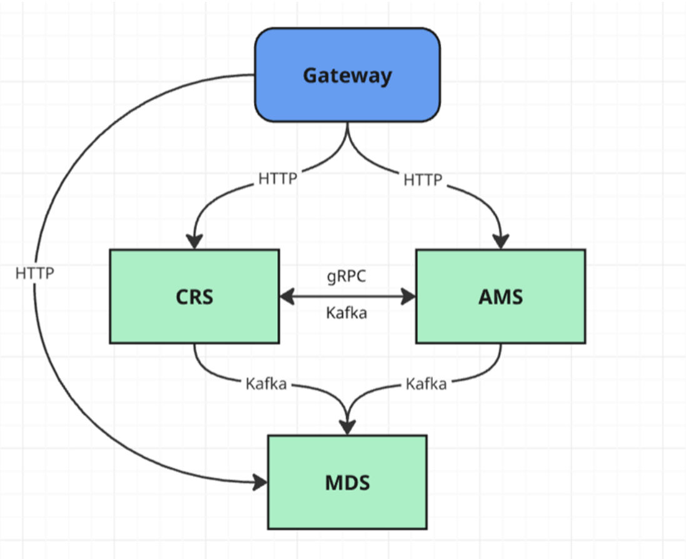

# Central Registry Service (CRS)

## Overview

**Central Registry Service (CRS)** — это централизованный сервис для регистрации и обнаружения (service discovery) других сервисов в системе.

Сервис реализован на **ASP.NET Core** и предназначен для использования в микросервисной архитектуре как **единая точка хранения информации о сервисах**.

---

## Архитектура

CRS является частью микросервисной системы Medical Facility Management Service:

---
## Использование в командном проекте

CRS — центральный элемент взаимодействия всех сервисов команды.

Функциональность:

* CRUD операции для сущности "Врач":
  * Создание профиля врача (ФИО, специализация, лицензия, контакты)
  * Редактирование данных врача
  * Деактивация врача

* CRUD операции для сущности "Пациент":
  * Регистрация нового пациента (ФИО, дата рождения, контакты, полис)
  * Обновление данных пациента

* Управление расписанием врачей:
  * Назначение рабочих часов врачам
  * Блокировка времени (отпуск, больничный, обучение)
  * Публикация недоступного времени врача
* Валидация доступности через gRPC API
* Публикация событий об изменениях ресурсов

---

## Технологии

* C#
* ASP.NET Core
* Entity Framework Core
* PostgreSQL
* Docker
* Kafka
* gRPC
* Protobuff

---

## Возможные улучшения

* Health-check сервисов
* Авто-очистка неактивных сервисов
* Кэширование (Redis)
* Load balancing
* Интеграция с API Gateway

---
